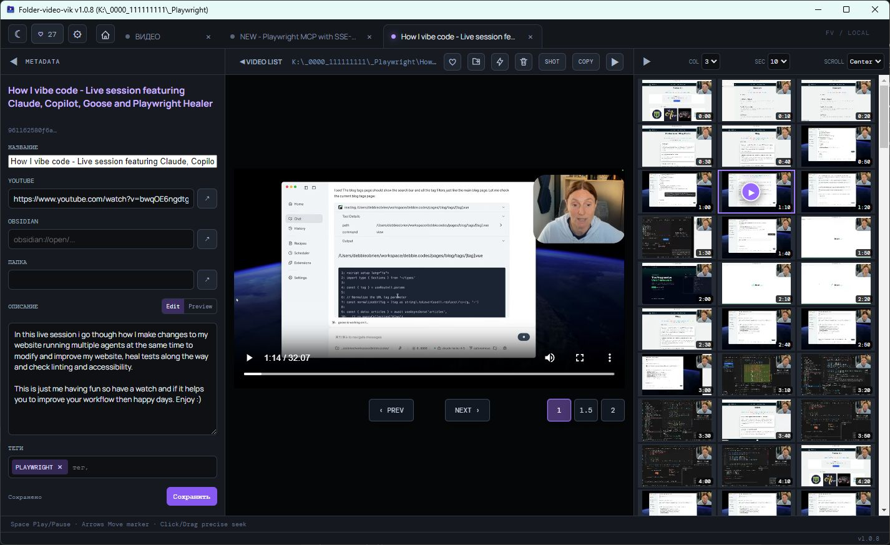
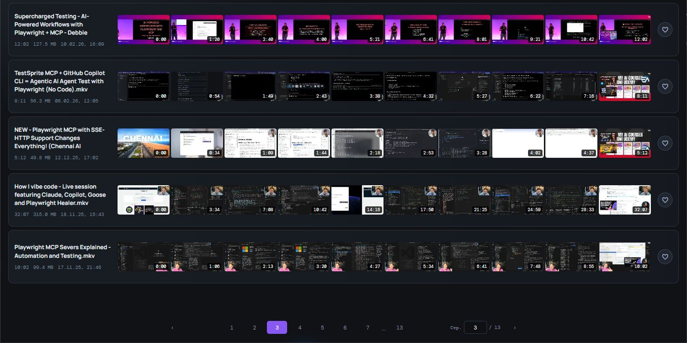
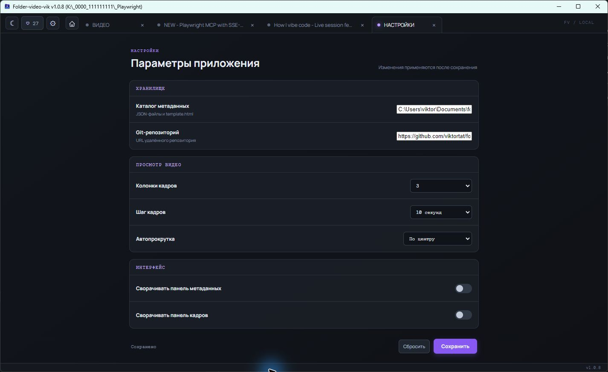

# Folder-video

[English version](README.md)

Folder-video помогает быстро найти нужный момент среди локальных видео. В списке видно ленту кадров каждого файла, а открытый ролик получает отдельную вкладку с подробной сеткой кадров.

## Интерфейс

<table>
  <tr>
    <td></td>
    <td></td>
  </tr>
</table>

## Что умеет приложение

- Открывает локальную папку через нативный диалог, перетаскивание или контекстное меню Проводника Windows после установки дополнительной интеграции.
- Сканирует поддерживаемые файлы, при необходимости во вложенных папках, и даёт фильтр, сортировку и постраничную навигацию.
- Открывает несколько роликов во вкладках. Во вкладке доступны обычные элементы плеера, выбор скорости и сетка кадров для перехода кликом или перетаскиванием.
- Хранит до десяти последних папок и отдельный список избранных видео между запусками.
- Сохраняет название, ссылки YouTube и Obsidian, Markdown-описание и теги в JSON-файлах. Метаданные привязаны к SHA-256 содержимого и остаются с тем же файлом после переноса.
- Сохраняет текущий кадр, копирует имя файла без расширения, открывает расположение или системный плеер, переносит файл и отправляет его в корзину Windows после подтверждения.
- Создаёт копию ролика с двойной скоростью, если `ffmpeg` доступен через `PATH`.

## Установка и запуск

Если у вас есть `folder-video-setup.exe`, запустите его и пройдите установку Windows. После неё появятся ярлыки в меню «Пуск» и на рабочем столе.

Инструкции по сборке из исходников находятся в [технической документации](docs/README.md). Portable-версия лежит в папке `out\\folder-video-win32-x64`; не переносите отдельно `folder-video.exe`, запускайте его из этой папки.

## Как работать

1. Выберите папку с видео или перетащите её в окно.
2. Найдите ролик по ленте кадров, фильтру и сортировке.
3. Откройте строку видео. При необходимости настройте число колонок, шаг кадров и автопрокрутку.
4. Кликните по сетке или потяните маркер, чтобы перейти к нужному моменту. Плеером также управляют стрелки, Home, End и Space.
5. Добавьте заметки и теги в панели метаданных, затем сохраните их.

## Поддерживаемые файлы и ограничения

Folder-video сканирует `mp4`, `webm`, `mov`, `avi`, `mkv`, `m4v` и `ogv`. Воспроизведение зависит и от кодека, который поддерживает Chromium.

Полный набор возможностей рассчитан на Windows 10 и Windows 11. Интеграция с Проводником, удаление в корзину, сохранение дат у ускоренной копии и перенос файлов относятся к Windows. Приложение работает с локальными файлами и не загружает видео в интернет. FFmpeg нужен только для создания ускоренной копии.

[Техническая документация](docs/README.md)

## Лицензия

MIT.
