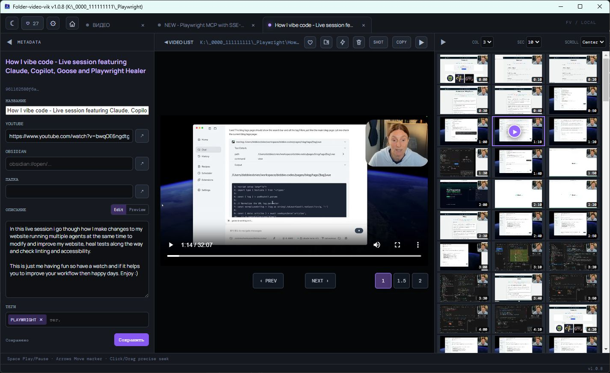
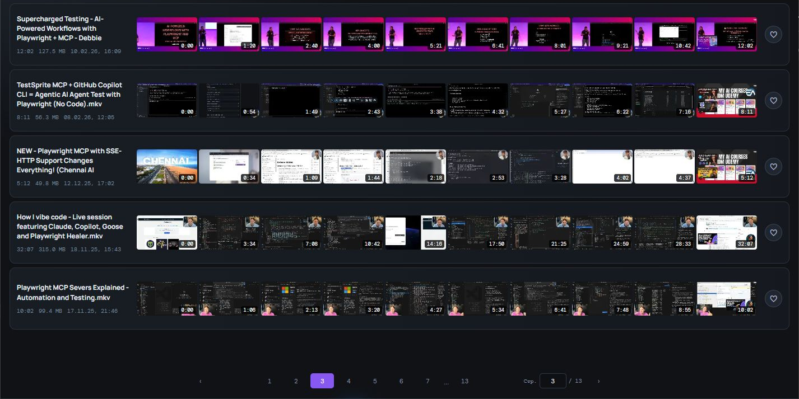
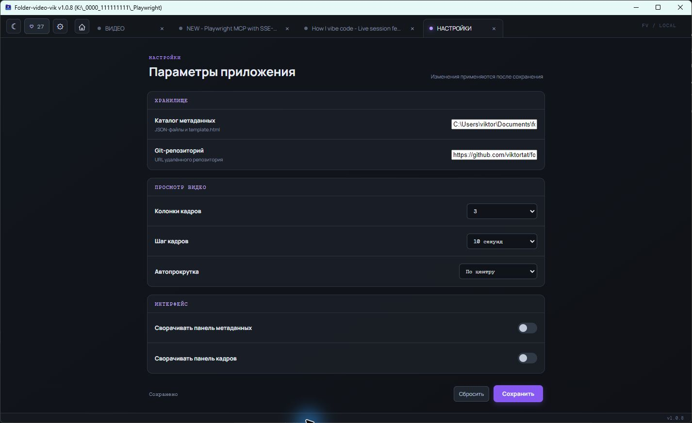

# Folder-video

[English version](README.md)

Folder-video помогает быстро найти нужный момент среди локальных видео. В списке видно ленту кадров каждого файла, а открытый ролик получает отдельную вкладку с подробной сеткой кадров.
Ширину боковой панели кадров и транскрипции можно менять перетаскиванием её левой границы. Приложение сохраняет выбранную ширину; когда разделитель в фокусе, используйте ← и →.

## Интерфейс

<table>
  <tr>
    <td></td>
    <td></td>
  </tr>
</table>

## Что умеет приложение

- Открывает локальную папку через нативный диалог, перетаскивание или контекстное меню Проводника Windows после установки дополнительной интеграции.
- Сканирует поддерживаемые файлы, при необходимости во вложенных папках, и даёт фильтры по имени и давности изменения, скрытие файлов нулевого размера, сортировку по дате, имени и размеру файла, а также постраничную навигацию.
- Открывает несколько роликов во вкладках. Во вкладке доступны обычные элементы плеера, выбор скорости и сетка кадров для перехода кликом или перетаскиванием.
- Хранит до десяти последних папок, избранные видео и до тридцати недавно просмотренных видео между запусками. Любую запись из списка последних видео можно удалить, не удаляя сам файл.
- Сохраняет название, ссылки YouTube и Obsidian, Markdown-описание и теги в JSON-файлах. Метаданные привязаны к SHA-256 содержимого и остаются с тем же файлом после переноса.
- Сохраняет текущий кадр, копирует имя файла без расширения, открывает расположение или системный плеер, переносит файл и отправляет его в корзину Windows после подтверждения.
- Создаёт копию ролика с двойной скоростью, если `ffmpeg` доступен через `PATH`.
- По нажатию транскрибирует ролик локальной моделью Parakeet TDT 0.6B v3 в формате GGUF через `transcribe.dll`. Правая панель переключается между миниатюрами и кликабельными сегментами SRT: клик по сегменту переводит плеер на его время.
- Если в настройках указан ключ DeepSeek, автоматически создаёт сводку на русском и до десяти тем по транскрипции. Клик по теме переводит плеер к соответствующему фрагменту. Сводка лежит рядом с SRT в файле `<имя>.summary.json`; ключ хранится отдельно в зашифрованном виде.
- Хранит заметки с таймкодами в отдельном файле `<имя>.notes.md` в `%APPDATA%\folder-video\transcripts`. На паузе поле под плеером доступно для записи; при воспроизведении подходящая заметка видна 10 секунд видео. Во вкладке «Заметки» есть общий текстовый редактор и кликабельные переходы к заметкам.

## Установка и запуск

Если у вас есть `folder-video-setup.exe`, запустите его и пройдите установку Windows. После неё появятся ярлыки в меню «Пуск» и на рабочем столе.

Инструкции по сборке из исходников находятся в [технической документации](docs/README.md). Portable-версия лежит в папке `out\\folder-video-win32-x64`; не переносите отдельно `folder-video.exe`, запускайте его из этой папки.

## Как работать

1. Выберите папку с видео или перетащите её в окно.
2. Найдите ролик по ленте кадров, фильтру и сортировке.
3. Откройте строку видео. При необходимости настройте число колонок, шаг кадров и автопрокрутку.
4. Кликните по сетке или потяните маркер, чтобы перейти к нужному моменту. Плеером также управляют стрелки, Home, End и Space.
5. Добавьте заметки и теги в панели метаданных, затем сохраните их.
6. Для заметки с таймкодом поставьте видео на паузу и введите текст под плеером. Во вкладке «Заметки» можно править весь текст блоками с заголовком `[м:сс]` и разделителем `---` на отдельной строке; изменения сохраняются автоматически. Редактор по умолчанию свёрнут: кнопка у заголовка разворачивает его, а список переходов сортируется по времени и остаётся доступным. Нажатие на заметку переводит видео к её времени и возвращает фокус на управление плеером, чтобы Space ставил видео на паузу.

## Поддерживаемые файлы и ограничения

Folder-video сканирует `mp4`, `webm`, `mov`, `avi`, `mkv`, `m4v` и `ogv`. Воспроизведение зависит и от кодека, который поддерживает Chromium.

Полный набор возможностей рассчитан на Windows 10 и Windows 11. Интеграция с Проводником, удаление в корзину, сохранение дат у ускоренной копии, перенос файлов и транскрибация Parakeet относятся к Windows. Видео остаётся на компьютере; при создании сводки текст транскрипции отправляется в API DeepSeek. Для транскрибации нужны `ffmpeg`, `ffprobe` и Python в `PATH`. Файл модели `parakeet-tdt-0.6b-v3-Q8_0.gguf` ищется в кэше HuggingFace; путь к другому файлу GGUF можно указать в настройках. SRT и сводка хранятся в профиле приложения, а не рядом с portable-версией. Сводка создаётся заново при изменении транскрипции или выбранной модели DeepSeek. Ошибочный запрос можно повторить во вкладке сводки.

[Техническая документация](docs/README.md)

## Лицензия

MIT.
