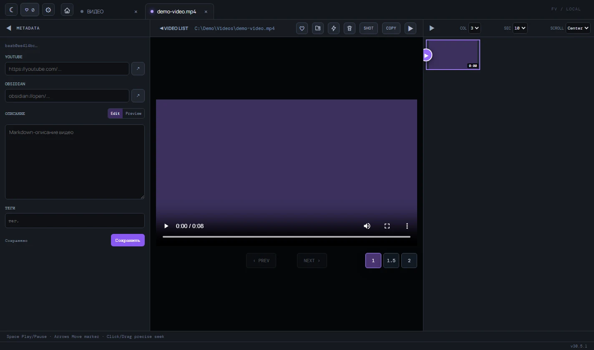

# Вернуться к видео и сохранить контекст

Избранное собирает ролики из разных папок в одном списке, а метаданные помогают не терять ссылки и собственные заметки.

## Добавить видео в избранное

1. В списке нажмите `♡` в строке ролика или откройте видео и нажмите ту же кнопку в плеере.
2. Нажмите кнопку избранного в верхней панели.
3. Выберите ролик в списке, чтобы открыть его.

Избранное хранится между запусками приложения и не создаёт отдельные миниатюры. Если файл переместили или удалили вне Folder-video, он останется в списке, пока вы не удалите его оттуда.

## Заполнить метаданные

1. Откройте видео.
2. В панели `METADATA` заполните нужные поля.
3. Добавьте теги через поле `тег,` и клавишу Enter.
4. При необходимости переключитесь с `Edit` на `Preview`.
5. Нажмите `Сохранить`.

Пустые ссылки допустимы. Ссылка YouTube должна вести на YouTube, а ссылка Obsidian начинаться с `obsidian://`.

## Где хранятся данные

Приложение создаёт SQLite-базу и файл настроек в каталоге данных Electron. Точный путь зависит от операционной системы. В настройках можно выбрать существующую базу или создать новую. Если в открытых вкладках есть несохранённые метаданные, приложение предложит сохранить их, отказаться от изменений или отменить смену базы.

С настройками просмотра можно ознакомиться в [инструкции по первому запуску](../getting-started.md).
