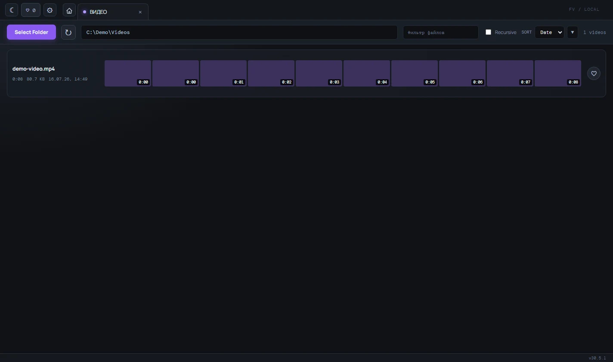

# Найти нужное видео в папке

Вы получите короткий список подходящих роликов и сможете открыть нужный файл в плеере, не перебирая видео вслепую.

## Когда это полезно

Используйте этот режим для больших папок, где имена файлов не говорят, что находится внутри. Лента кадров даёт быстрый визуальный обзор каждого ролика.

## Пошаговый сценарий

1. Откройте папку через выбор каталога или перетащите её в окно.
2. Включите `Recursive`, если видео лежат во вложенных папках.
3. Найдите нужный фрагмент по ленте кадров или введите часть имени в поле `Фильтр файлов`.
4. При необходимости измените `Sort` на сортировку по имени или дате и переключите направление стрелкой.
5. Кликните по строке видео. Откроется вкладка плеера.

В строке также доступны кнопка избранного и контекстное меню. Через контекстное меню можно скопировать путь, перенести файл в другую папку или отправить его в корзину Windows после подтверждения.

## Последние папки

Главная страница хранит до десяти недавно открытых папок. Важную папку можно закрепить, чтобы новые открытия её не вытеснили.

## Поддерживаемые файлы

Folder-video сканирует файлы с расширениями `mp4`, `webm`, `mov`, `avi`, `mkv`, `m4v` и `ogv`. Воспроизведение зависит от кодека, который поддерживает Chromium: контейнер с подходящим расширением может не открыться, если его кодек не поддерживается системой приложения.

После открытия ролика переходите к [покадровому просмотру и метаданным](video-review.md).
