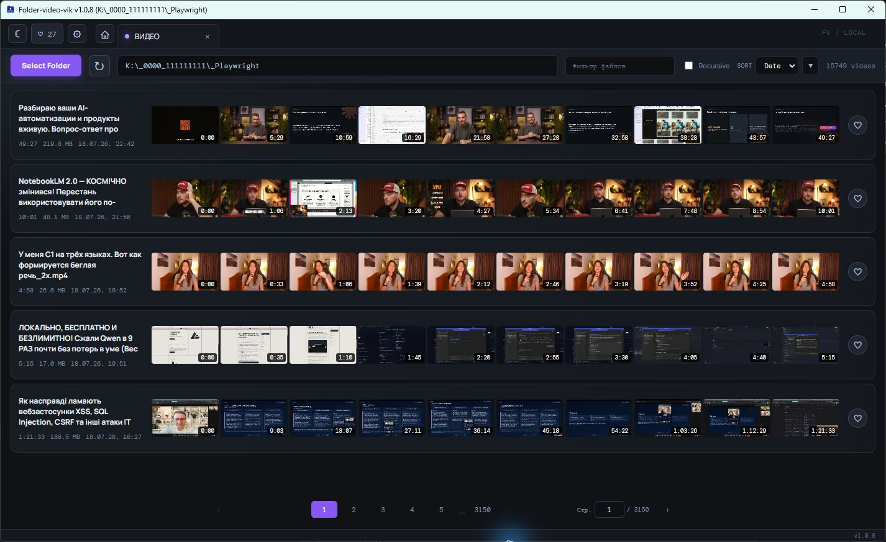

# Найти нужное видео в папке

Ленты кадров помогают понять содержимое ролика до открытия. Это удобно для записей экрана, лекций и больших архивов, где имя файла мало о чём говорит.

## Как найти ролик

1. Откройте папку через выбор каталога или перетащите её в окно.
2. Включите `Recursive`, если ролики лежат во вложенных папках.
3. Введите часть имени в поле «Фильтр файлов» или просмотрите ленты кадров.
4. При необходимости выберите сортировку по имени или дате и смените направление стрелкой.
5. Нажмите строку ролика. Приложение откроет вкладку плеера.

В строке доступны избранное и контекстное меню. Через меню можно скопировать путь, перенести файл или отправить его в корзину Windows после подтверждения.

## Последние папки

Главная страница хранит до десяти недавних папок. Важную папку можно закрепить, чтобы новые открытия её не вытеснили.

## Поддерживаемые файлы

Folder-video сканирует `mp4`, `webm`, `mov`, `avi`, `mkv`, `m4v` и `ogv`. Если видео не воспроизводится, причина может быть в кодеке, а не в расширении файла.

После выбора ролика переходите к [покадровому просмотру и метаданным](video-review.md).
