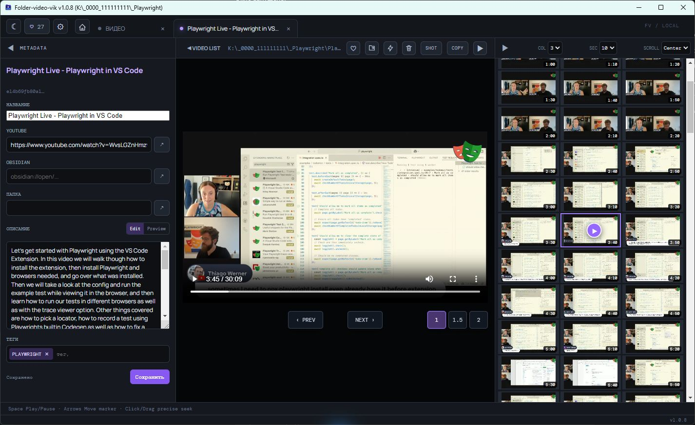

# Просмотреть ролик по кадрам

Вкладка плеера помогает быстро найти сцену, перейти к ней по сетке и сохранить контекст ролика в метаданных.

## Плеер и сетка кадров

Откройте ролик из библиотеки. Справа появится сетка кадров, а слева - панель метаданных.

- `Col` меняет число колонок: 3, 4, 5, 6 или 8.
- `Sec` задаёт шаг: 5, 10, 15, 30 или 60 секунд.
- `Scroll` управляет прокруткой сетки: `Center`, `Edge` или `OFF`.
- Клик по кадру переносит плеер к этому времени. Маркер можно перетаскивать для точного перехода.
- Стрелки, Home, End и Space управляют просмотром с клавиатуры.

Скорости `1x`, `1.5x` и `2x` меняют темп воспроизведения, но не создают новый файл.

## Действия с файлом

В верхней панели можно сохранить текущий кадр, скопировать имя без расширения, открыть расположение ролика или системный плеер. Перенос и удаление доступны рядом с заголовком; удаление требует подтверждения и отправляет файл в корзину Windows.

Команда ускорения создаёт в той же папке копию с суффиксом `_2x` и открывает её в новой вкладке. Для неё нужен FFmpeg в `PATH`.

## Метаданные

В панели `METADATA` можно сохранить ссылку YouTube, ссылку `obsidian://`, Markdown-описание и теги. Описание переключается между Edit и Preview. Метаданные привязаны к SHA-256 содержимого, поэтому остаются с тем же файлом после переноса.

[Избранное и метаданные](favorites-and-metadata.md) помогают вернуться к ролику позднее.
