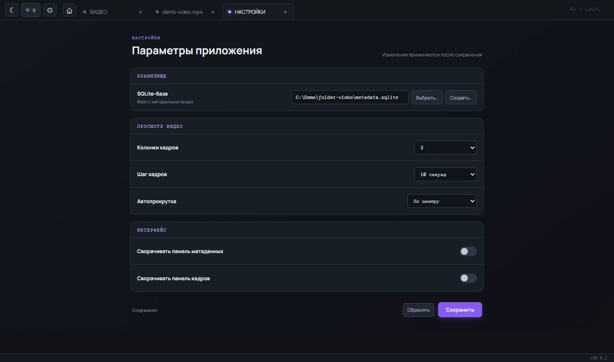

# Первый запуск

После запуска Folder-video открывается главная страница. Папка не восстанавливается автоматически, поэтому каждый новый сеанс начинается с выбора каталога.

## Открыть папку

1. Нажмите кнопку выбора папки на главной странице.
2. Укажите каталог с видео.
3. Если нужно искать во вложенных папках, включите `Recursive`.

Можно также перетащить папку в окно приложения. На главной странице появится список найденных видео с именем, длительностью, размером, датой изменения и лентой кадров.

Чтобы повторить сканирование после появления новых файлов, нажмите кнопку обновления рядом с путём папки.

## Ориентироваться в окне

- Кнопка с домиком возвращает на главную страницу.
- Каждое открытое видео появляется в собственной вкладке. Повторный клик по тому же файлу активирует уже открытую вкладку.
- В верхней панели находятся тема, избранное и настройки.
- Путь выбранной папки виден в панели над списком.

## Если список большой

Введите часть имени в поле `Фильтр файлов`. Поиск не учитывает регистр и сохраняется при переходе между страницами.

В блоке `Sort` выберите сортировку по имени или дате. Кнопка со стрелкой меняет направление. Внизу списка доступны номера страниц, кнопки перехода и поле `Стр.` для прямого перехода по номеру.

## Настроить приложение

Кнопка с шестерёнкой открывает вкладку настроек. Там можно изменить тему, число колонок сетки кадров, интервал между кадрами, поведение прокрутки и состояние панелей. Настройки начинают действовать после нажатия `Сохранить`.

Подробнее о просмотре и заметках - в [инструкции по работе с видео](features/video-review.md).
